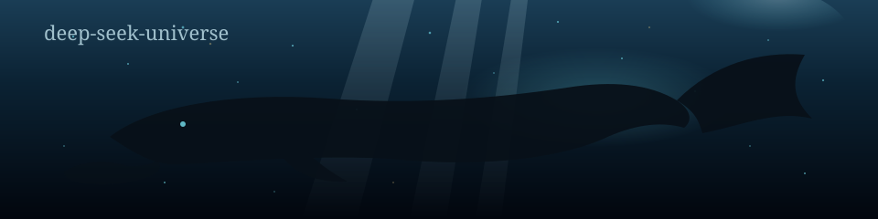

# awesome-dsh-themes [](https://awesome.re)

[](https://github.com/deepseek-ai/deepseek-harness)
[](LICENSE)
[](https://dshworks.github.io/awesome-dsh-themes/)

<p align="center">
  
</p>

A curated list of [DeepSeek Harness](https://github.com/deepseek-ai/deepseek-harness) (`dsh`) themes and `--dsw-*` token skins.

**[Open the live gallery](https://dshworks.github.io/awesome-dsh-themes/)** — wild whales, token seas, and a little ❤️. Welcome.

Most awesome lists are prose. This one is data: [`data/themes.json`](data/themes.json) is the source of truth; this README is rendered from it. Build on the JSON directly:

```sh
curl -s https://raw.githubusercontent.com/dshworks/awesome-dsh-themes/main/data/themes.json
```

## Contents

- [The token seam](#the-token-seam)
- [Runtime](#runtime)
- [Token skins](#token-skins)
- [Skins](#skins)
- [Companions](#companions)
- [Fun / extras](#fun-extras)
- [Live gallery](#live-gallery)
- [Add a theme](#add-a-theme)
- [Roadmap](#roadmap)
- [License](#license)

## The token seam

Theming is ThemeRuntime over `--dsw-*` tokens: a static scale (`--dsw-static-*`) plus alias semantic layers (`--dsw-alias-*`). Built-in preference is `light` / `dark` / `system`. Five sheets ship in `@deepseek-ai/dsh-client-ui-theme`: `base`, `design-platform`, `scrollbar`, `gradient-shadow-text`, `shiki`.

The ThemeRuntime package is **not a theme store**. Its README says third-party themes are an extension point, not a product — registering one means overriding same-named alias variables, and there is no validation that an override set is complete.

The `dsh-theme` and `dsh-skin` GitHub topics keep growing. A short list is still honest; inventing skins would be worse. No harness themes turned up on gist.

## Runtime

ThemeRuntime over `--dsw-*` tokens. A lantern, not a marketplace.

### [dsh-client-ui-theme](https://github.com/deepseek-ai/deepseek-harness/tree/HEAD/packages/client/ui-theme)

<a href="https://dshworks.github.io/awesome-dsh-themes/preview.html?theme=dsh-client-ui-theme&scheme=dark"></a>

**[Live preview](https://dshworks.github.io/awesome-dsh-themes/preview.html?theme=dsh-client-ui-theme&scheme=dark)** — full-page fake dsh window, real `--dsw-*` tokens.

ThemeRuntime over --dsw-* tokens (static scale + alias semantic layers); light/dark/system. Five sheets: base, design-platform, scrollbar, gradient-shadow-text, shiki. Third-party themes are an extension point, not a product. Not a theme store.

**Repo:** [deepseek-ai/deepseek-harness](https://github.com/deepseek-ai/deepseek-harness/tree/HEAD/packages/client/ui-theme) · **License:** MIT · **Package:** [`@deepseek-ai/dsh-client-ui-theme`](https://www.npmjs.com/package/@deepseek-ai/dsh-client-ui-theme) · **dsh:** 0.1.0-rc.6

## Token skins

Community `--dsw-static-*` / `--dsw-alias-*` override sets that restyle the Web UI.

### [dsh-black-whale](https://github.com/147228/dsh-black-whale)

<a href="https://dshworks.github.io/awesome-dsh-themes/preview.html?theme=dsh-black-whale&scheme=dark"></a>

**[Live preview](https://dshworks.github.io/awesome-dsh-themes/preview.html?theme=dsh-black-whale&scheme=dark)** — full-page fake dsh window, real `--dsw-*` tokens plus this skin's override sheet.

Black Whale Lab --dsw-* token skin for the dsh Web UI: 黑鲸 × 夕小瑶 laboratory look.

```sh
dsh plugin --profile web add github:147228/dsh-black-whale
```

**Repo:** [147228/dsh-black-whale](https://github.com/147228/dsh-black-whale) · **License:** MIT · **dsh:** 0.1.0-rc.6

### [dsh-claude-theme](https://github.com/chajiuqqq/dsh-claude-theme)

<a href="https://dshworks.github.io/awesome-dsh-themes/preview.html?theme=dsh-claude-theme&scheme=dark"></a>

**[Live preview](https://dshworks.github.io/awesome-dsh-themes/preview.html?theme=dsh-claude-theme&scheme=dark)** — full-page fake dsh window, real `--dsw-*` tokens.

Claude-style --dsw-* interface theme for the dsh Web UI.

```sh
dsh plugin --profile web add github:chajiuqqq/dsh-claude-theme
```

**Repo:** [chajiuqqq/dsh-claude-theme](https://github.com/chajiuqqq/dsh-claude-theme) · **dsh:** 0.1.0-rc.6

### [dsh-four-seasons-theme](https://github.com/czj527/dsh-four-seasons-theme)

<a href="https://dshworks.github.io/awesome-dsh-themes/preview.html?theme=dsh-four-seasons-theme&scheme=dark"></a>

**[Live preview](https://dshworks.github.io/awesome-dsh-themes/preview.html?theme=dsh-four-seasons-theme&scheme=dark)** — full-page fake dsh window, real `--dsw-*` tokens.

Four-seasons --dsw-* theme for the dsh Web GUI: seasonal palettes, weather particles, day/night, moon, and a night lamp.

```sh
dsh plugin --profile web add github:czj527/dsh-four-seasons-theme
```

**Repo:** [czj527/dsh-four-seasons-theme](https://github.com/czj527/dsh-four-seasons-theme) · **dsh:** 0.1.0-rc.6

### [dsh-miku-skin](https://github.com/stushansusu/dsh-miku-skin)

<a href="https://dshworks.github.io/awesome-dsh-themes/preview.html?theme=dsh-miku-skin&scheme=dark"></a>

**[Live preview](https://dshworks.github.io/awesome-dsh-themes/preview.html?theme=dsh-miku-skin&scheme=dark)** — full-page fake dsh window, real `--dsw-*` tokens plus this skin's override sheet.

Hatsune Miku --dsw-* token skin: blue-purple-magenta gradients, frosted panels, custom wallpaper, light and dark.

```sh
dsh plugin --profile web add github:stushansusu/dsh-miku-skin
```

**Repo:** [stushansusu/dsh-miku-skin](https://github.com/stushansusu/dsh-miku-skin) · **License:** BSD-3-Clause · **dsh:** 0.1.0-rc.6

### [dsh-nachoneko-theme](https://github.com/TheMyceliumOfAntan/dsh-nachoneko-theme)

<a href="https://dshworks.github.io/awesome-dsh-themes/preview.html?theme=dsh-nachoneko-theme&scheme=dark"></a>

**[Live preview](https://dshworks.github.io/awesome-dsh-themes/preview.html?theme=dsh-nachoneko-theme&scheme=dark)** — full-page fake dsh window, real `--dsw-*` tokens plus this skin's override sheet.

Nachoneko (甘城猫猫) skin for the dsh Web GUI: #A3D3FF --dsw-static-*/--dsw-alias-* override set, full-screen wallpaper, frosted-glass sidebar/composer/code blocks and a settings-panel corner art, shipped as a self-contained dsh bundle+client plugin.

```sh
dsh plugin --profile web add github:TheMyceliumOfAntan/dsh-nachoneko-theme
```

**Repo:** [TheMyceliumOfAntan/dsh-nachoneko-theme](https://github.com/TheMyceliumOfAntan/dsh-nachoneko-theme) · **License:** MIT · **dsh:** 0.1.0-rc.6

*Confirmed --dsw-alias-* override set (deepseek/blue static scales + alias layers) and boot roster on 0.1.0-rc.6; a fresh main-UI boot stall was reported on one machine -- client.js payload was cut 440KB -> 238KB (wallpaper base64 deduped) in response, and a local no-cache fresh boot reaches the main chat UI, but the stall is not independently re-confirmed fixed. Hashed module-class overrides (frame/conversation/composer/settings) are pinned to 0.1.0-rc.6.*

### [dsh-skin](https://github.com/KinGao294/dsh-skin)

<a href="https://dshworks.github.io/awesome-dsh-themes/preview.html?theme=dsh-skin&scheme=dark"></a>

**[Live preview](https://dshworks.github.io/awesome-dsh-themes/preview.html?theme=dsh-skin&scheme=dark)** — full-page fake dsh window, real `--dsw-*` tokens.

Skin switcher and custom wallpaper for dsh: curated --dsw-alias-* palettes with opacity and blur, persisted per browser.

```sh
dsh plugin --profile web add github:KinGao294/dsh-skin
```

**Repo:** [KinGao294/dsh-skin](https://github.com/KinGao294/dsh-skin) · **License:** MIT · **dsh:** 0.1.0-rc.6

### [dsh-skin-diablo-dark](https://github.com/dengxuhui/dsh-skin-diablo-dark)

<a href="https://dshworks.github.io/awesome-dsh-themes/preview.html?theme=dsh-skin-diablo-dark&scheme=dark"></a>

**[Live preview](https://dshworks.github.io/awesome-dsh-themes/preview.html?theme=dsh-skin-diablo-dark&scheme=dark)** — full-page fake dsh window, real `--dsw-*` tokens plus this skin's override sheet.

Diablo dark-gothic --dsw-* token skin (暗黑·熔火) for the dsh Web GUI.

```sh
dsh plugin --profile web add github:dengxuhui/dsh-skin-diablo-dark
```

**Repo:** [dengxuhui/dsh-skin-diablo-dark](https://github.com/dengxuhui/dsh-skin-diablo-dark) · **License:** MIT · **dsh:** 0.1.0-rc.6

### [dsh-skin-kawaii2000](https://github.com/shunkwon/dsh-skin-kawaii2000)

<a href="https://dshworks.github.io/awesome-dsh-themes/preview.html?theme=dsh-skin-kawaii2000&scheme=dark"></a>

**[Live preview](https://dshworks.github.io/awesome-dsh-themes/preview.html?theme=dsh-skin-kawaii2000&scheme=dark)** — full-page fake dsh window, real `--dsw-*` tokens plus this skin's override sheet.

Kawaii 2000s --dsw-* token skin: candy pink and baby blue for the dsh Web UI.

```sh
dsh plugin --profile web add github:shunkwon/dsh-skin-kawaii2000
```

**Repo:** [shunkwon/dsh-skin-kawaii2000](https://github.com/shunkwon/dsh-skin-kawaii2000) · **License:** MIT · **dsh:** 0.1.0-rc.6

### [dsh-theme](https://github.com/oil-oil/dsh-theme)

<a href="https://dshworks.github.io/awesome-dsh-themes/preview.html?theme=dsh-theme&scheme=dark"></a>

**[Live preview](https://dshworks.github.io/awesome-dsh-themes/preview.html?theme=dsh-theme&scheme=dark)** — full-page fake dsh window, real `--dsw-*` tokens.

Live theme editor for dsh: curated --dsw-* palettes and typography controls.

```sh
dsh plugin --profile web add github:oil-oil/dsh-theme
```

**Repo:** [oil-oil/dsh-theme](https://github.com/oil-oil/dsh-theme) · **License:** MIT · **dsh:** 0.1.0-rc.6

### [dsh-theme-neko](https://github.com/drfccv/dsh-theme-neko)

<a href="https://dshworks.github.io/awesome-dsh-themes/preview.html?theme=dsh-theme-neko&scheme=dark"></a>

**[Live preview](https://dshworks.github.io/awesome-dsh-themes/preview.html?theme=dsh-theme-neko&scheme=dark)** — full-page fake dsh window, real `--dsw-*` tokens plus this skin's override sheet.

Nachoneko (甘城猫猫) --dsw-* token skin for the dsh Web GUI.

```sh
dsh plugin --profile web add github:drfccv/dsh-theme-neko
```

**Repo:** [drfccv/dsh-theme-neko](https://github.com/drfccv/dsh-theme-neko) · **License:** MIT · **dsh:** 0.1.0-rc.6

### [dsh-theme-ti](https://github.com/longyu065/dsh-theme-ti)

<a href="https://dshworks.github.io/awesome-dsh-themes/preview.html?theme=dsh-theme-ti&scheme=dark"></a>

**[Live preview](https://dshworks.github.io/awesome-dsh-themes/preview.html?theme=dsh-theme-ti&scheme=dark)** — full-page fake dsh window, real `--dsw-*` tokens.

Dota 2 The International --dsw-* token skin: TI6 red, immortal-shield gold, vector wings and a starfield.

```sh
dsh plugin --profile web add github:longyu065/dsh-theme-ti
```

**Repo:** [longyu065/dsh-theme-ti](https://github.com/longyu065/dsh-theme-ti) · **License:** MIT · **dsh:** 0.1.0-rc.6

### [dsh-theme-vscode-red](https://github.com/RainbowDashy/dsh-theme-vscode-red)

<a href="https://dshworks.github.io/awesome-dsh-themes/preview.html?theme=dsh-theme-vscode-red&scheme=dark"></a>

**[Live preview](https://dshworks.github.io/awesome-dsh-themes/preview.html?theme=dsh-theme-vscode-red&scheme=dark)** — full-page fake dsh window, real `--dsw-*` tokens.

VS Code Red --dsw-* token theme: deep maroon surfaces with a #cc3333 accent, applied from client JS.

```sh
dsh plugin --profile web add github:RainbowDashy/dsh-theme-vscode-red
```

**Repo:** [RainbowDashy/dsh-theme-vscode-red](https://github.com/RainbowDashy/dsh-theme-vscode-red) · **License:** MIT · **dsh:** 0.1.0-rc.6

### [dsh-themes](https://github.com/MangMax/dsh-themes)

<a href="https://dshworks.github.io/awesome-dsh-themes/preview.html?theme=dsh-themes&scheme=dark"></a>

**[Live preview](https://dshworks.github.io/awesome-dsh-themes/preview.html?theme=dsh-themes&scheme=dark)** — full-page fake dsh window, real `--dsw-*` tokens.

Appearance plugin for dsh: built-in --dsw-* palettes, mixed light/dark, Open VSX search, and VS Code theme import.

```sh
dsh plugin --profile web add github:MangMax/dsh-themes
```

**Repo:** [MangMax/dsh-themes](https://github.com/MangMax/dsh-themes) · **License:** MIT · **dsh:** 0.1.0-rc.6

### [dsh-web-skins](https://github.com/ZeroZ-lab/dsh-web-skins)

<a href="https://dshworks.github.io/awesome-dsh-themes/preview.html?theme=dsh-web-skins&scheme=dark"></a>

**[Live preview](https://dshworks.github.io/awesome-dsh-themes/preview.html?theme=dsh-web-skins&scheme=dark)** — full-page fake dsh window, real `--dsw-*` tokens.

21 editor-inspired --dsw-* theme families for the dsh Web UI (Gruvbox, Catppuccin, Dracula, Solarized, Tokyo Night, and more), each with light and dark.

```sh
dsh plugin --profile web add github:ZeroZ-lab/dsh-web-skins
```

**Repo:** [ZeroZ-lab/dsh-web-skins](https://github.com/ZeroZ-lab/dsh-web-skins) · **License:** MIT · **dsh:** 0.1.0-rc.6

### [dsh-xiaoyao-skins](https://github.com/147228/dsh-xiaoyao-skins)

<a href="https://dshworks.github.io/awesome-dsh-themes/preview.html?theme=dsh-xiaoyao-skins&scheme=dark"></a>

**[Live preview](https://dshworks.github.io/awesome-dsh-themes/preview.html?theme=dsh-xiaoyao-skins&scheme=dark)** — full-page fake dsh window, real `--dsw-*` tokens.

夕小瑶 × dsh Web skin collection, installer, and community toolchain.

```sh
dsh plugin --profile web add github:147228/dsh-xiaoyao-skins
```

**Repo:** [147228/dsh-xiaoyao-skins](https://github.com/147228/dsh-xiaoyao-skins) · **dsh:** 0.1.0-rc.6

*Gallery: https://147228.github.io/dsh-xiaoyao-skins/*

### [freestyle-dsh-theme](https://github.com/suzike/freestyle-dsh-theme)

<a href="https://dshworks.github.io/awesome-dsh-themes/preview.html?theme=freestyle-dsh-theme&scheme=dark"></a>

**[Live preview](https://dshworks.github.io/awesome-dsh-themes/preview.html?theme=freestyle-dsh-theme&scheme=dark)** — full-page fake dsh window, real `--dsw-*` tokens.

dsh theme studio: OKLCH theme proposals and a designer that persists across restarts.

```sh
dsh plugin --profile web add github:suzike/freestyle-dsh-theme
```

**Repo:** [suzike/freestyle-dsh-theme](https://github.com/suzike/freestyle-dsh-theme) · **License:** BSD-3-Clause · **dsh:** 0.1.0-rc.6

## Skins

Theme and skin listings that restyle the dsh Web UI.

### [dsh-client-ui-skin-priestess](https://github.com/Sealessland/dsh-client-ui-skin-priestess)

<a href="https://dshworks.github.io/awesome-dsh-themes/preview.html?theme=dsh-client-ui-skin-priestess&scheme=dark"></a>

**[Live preview](https://dshworks.github.io/awesome-dsh-themes/preview.html?theme=dsh-client-ui-skin-priestess&scheme=dark)** — full-page fake dsh window, real `--dsw-*` tokens.

Priestess dual-theme skin for the dsh Web UI: night portrait with graphite glass, light portrait with cool-white glass.

```sh
dsh plugin --profile web add github:Sealessland/dsh-client-ui-skin-priestess
```

**Repo:** [Sealessland/dsh-client-ui-skin-priestess](https://github.com/Sealessland/dsh-client-ui-skin-priestess) · **License:** MIT · **dsh:** 0.1.0-rc.6

### [dsh-deep-whale](https://github.com/Small-tailqwq/dsh-deep-whale)

<a href="https://dshworks.github.io/awesome-dsh-themes/preview.html?theme=dsh-deep-whale&scheme=dark"></a>

**[Live preview](https://dshworks.github.io/awesome-dsh-themes/preview.html?theme=dsh-deep-whale&scheme=dark)** — full-page fake dsh window, real `--dsw-*` tokens.

DSH Web whale-girl skin series (maid-atelier). Theme/skin-shaped third-party listing.

```sh
dsh plugin --profile web add github:Small-tailqwq/dsh-deep-whale
```

**Repo:** [Small-tailqwq/dsh-deep-whale](https://github.com/Small-tailqwq/dsh-deep-whale) · **License:** CC-BY-NC-SA-4.0 · **dsh:** 0.1.0-rc.5

### [dsh-qq2006](https://github.com/LaplaceYoung/dsh-qq2006)

<a href="https://dshworks.github.io/awesome-dsh-themes/preview.html?theme=dsh-qq2006&scheme=dark"></a>

**[Live preview](https://dshworks.github.io/awesome-dsh-themes/preview.html?theme=dsh-qq2006&scheme=dark)** — full-page fake dsh window, real `--dsw-*` tokens.

QQ2006 skin plugin: registers a qq2006 theme, mirrors body[data-ds-skin], ships a global skin sheet and assets.

```sh
dsh plugin --profile web add github:LaplaceYoung/dsh-qq2006
```

**Repo:** [LaplaceYoung/dsh-qq2006](https://github.com/LaplaceYoung/dsh-qq2006) · **License:** BSD-3-Clause · **dsh:** 0.1.0-rc.5

### [dsh-theme-taffy](https://github.com/Misaki14987/dsh-theme-taffy)

<a href="https://dshworks.github.io/awesome-dsh-themes/preview.html?theme=dsh-theme-taffy&scheme=dark"></a>

**[Live preview](https://dshworks.github.io/awesome-dsh-themes/preview.html?theme=dsh-theme-taffy&scheme=dark)** — full-page fake dsh window, real `--dsw-*` tokens.

Taffy-themed skin for the dsh Web UI (我不是雏草姬).

```sh
dsh plugin --profile web add github:Misaki14987/dsh-theme-taffy
```

**Repo:** [Misaki14987/dsh-theme-taffy](https://github.com/Misaki14987/dsh-theme-taffy) · **dsh:** 0.1.0-rc.6

### [dsh-tp7-skin](https://github.com/adamwdff/dsh-tp7-skin)

<a href="https://dshworks.github.io/awesome-dsh-themes/preview.html?theme=dsh-tp7-skin&scheme=dark"></a>

**[Live preview](https://dshworks.github.io/awesome-dsh-themes/preview.html?theme=dsh-tp7-skin&scheme=dark)** — full-page fake dsh window, real `--dsw-*` tokens.

Turbo Pascal 7.0 blue-screen skin for the dsh Web GUI.

```sh
dsh plugin --profile web add github:adamwdff/dsh-tp7-skin
```

**Repo:** [adamwdff/dsh-tp7-skin](https://github.com/adamwdff/dsh-tp7-skin) · **License:** MIT · **dsh:** 0.1.0-rc.6

### [dsh-web-ui](https://github.com/zhu1090093659/dsh-web-ui)

<a href="https://dshworks.github.io/awesome-dsh-themes/preview.html?theme=dsh-web-ui&scheme=dark"></a>

**[Live preview](https://dshworks.github.io/awesome-dsh-themes/preview.html?theme=dsh-web-ui&scheme=dark)** — full-page fake dsh window, real `--dsw-*` tokens.

Third-party plugin/skin collection for the dsh Web UI. Skin center routes around the theme-persistence gap. Also listed in awesome-dsh-plugins.

```sh
dsh plugin --profile web add github:zhu1090093659/dsh-web-ui
```

**Repo:** [zhu1090093659/dsh-web-ui](https://github.com/zhu1090093659/dsh-web-ui) · **dsh:** 0.1.0-rc.5

### [dsh-webUI-Glass-Theme](https://github.com/makuralymi/dsh-webUI-Glass-Theme)

<a href="https://dshworks.github.io/awesome-dsh-themes/preview.html?theme=dsh-webUI-Glass-Theme&scheme=dark"></a>

**[Live preview](https://dshworks.github.io/awesome-dsh-themes/preview.html?theme=dsh-webUI-Glass-Theme&scheme=dark)** — full-page fake dsh window, real `--dsw-*` tokens.

Frosted-glass theme for the dsh Web UI: translucent surfaces and a global backdrop blur.

```sh
dsh plugin --profile web add github:makuralymi/dsh-webUI-Glass-Theme
```

**Repo:** [makuralymi/dsh-webUI-Glass-Theme](https://github.com/makuralymi/dsh-webUI-Glass-Theme) · **dsh:** 0.1.0-rc.6

### [dskin](https://github.com/dancingmemory/dskin)

<a href="https://dshworks.github.io/awesome-dsh-themes/preview.html?theme=dskin&scheme=dark"></a>

**[Live preview](https://dshworks.github.io/awesome-dsh-themes/preview.html?theme=dskin&scheme=dark)** — full-page fake dsh window, real `--dsw-*` tokens.

Cartoon pixel skin for the dsh Web GUI: living pixel pets that stroll, blink, and hop.

```sh
dsh plugin --profile web add github:dancingmemory/dskin
```

**Repo:** [dancingmemory/dskin](https://github.com/dancingmemory/dskin) · **License:** MIT · **dsh:** 0.1.0-rc.6

## Companions

Desktop pets and extras that live beside the UI. Not token skins — still part of the dive.

### [whale-girl](https://github.com/vlln/whale-girl)

<a href="https://dshworks.github.io/awesome-dsh-themes/preview.html?theme=whale-girl&scheme=dark"></a>

**[Live preview](https://dshworks.github.io/awesome-dsh-themes/preview.html?theme=whale-girl&scheme=dark)** — full-page fake dsh window, real `--dsw-*` tokens.

DSH Web GUI desktop-pet plugin (QQ pet form): floating companion. Theme/skin-shaped listing.

```sh
dsh plugin --profile web add github:vlln/whale-girl
```

**Repo:** [vlln/whale-girl](https://github.com/vlln/whale-girl) · **License:** MIT · **dsh:** 0.1.0-rc.5

## Fun / extras

Gags and extras that restyle the whole Web UI for laughs. Not `--dsw-*` token skins — still part of the dive.

### [dsh-ads](https://github.com/Nagi-ovo/dsh-ads)

<a href="https://dshworks.github.io/awesome-dsh-themes/preview.html?theme=dsh-ads&scheme=dark"></a>

**[Live preview](https://dshworks.github.io/awesome-dsh-themes/preview.html?theme=dsh-ads&scheme=dark)** — full-page fake dsh window, real `--dsw-*` tokens.

2005-portal gag plugin that restyles the whole Web UI with fake ads — sidebar banners, in-thread plugs, corner popups. Not a --dsw-* token skin.

```sh
dsh plugin --profile web add github:Nagi-ovo/dsh-ads
```

**Repo:** [Nagi-ovo/dsh-ads](https://github.com/Nagi-ovo/dsh-ads) · **dsh:** 0.1.0-rc.6

## Live gallery

The [deep-seek-universe gallery](https://dshworks.github.io/awesome-dsh-themes/) lives on GitHub Pages (`/docs`). Same entries. More water. Cards show a real source-repo shot when we have one, or a drawn whale if we do not. **[Live](https://dshworks.github.io/awesome-dsh-themes/)** / Dive opens a full-page fake dsh window (real `--dsw-*` tokens, plus an override sheet when we have one). GitHub strips iframes, so the README uses thumbnails and links.

## Roadmap

Shorter install is a [plan](ROADMAP.md), not a fake CLI. Today the real command is already `dsh plugin --profile web add github:owner/repo`.

## Add a theme

Open a PR against [`data/themes.json`](data/themes.json) only; the README and `docs/themes.json` are regenerated. See [CONTRIBUTING.md](CONTRIBUTING.md). A theme here is a ThemeRuntime, a `--dsw-*` override set, a skin that actually restyles the dsh Web UI, a companion that lives beside it, or a fun extra. The ThemeRuntime package is an extension point, not a store, and this list is not one either. A real preview image helps a lot. If you ship a CSS override sheet, add `previewCss` so the live window can wear it. Optional `install` overrides the derived one-liner; see [ROADMAP.md](ROADMAP.md).

## License

MIT. **Not affiliated with DeepSeek.**
